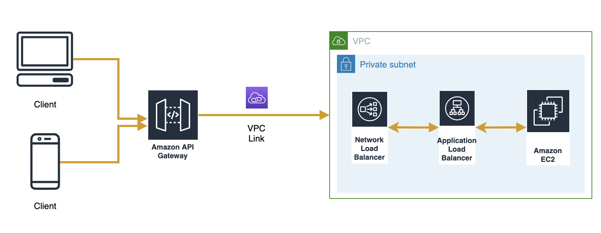
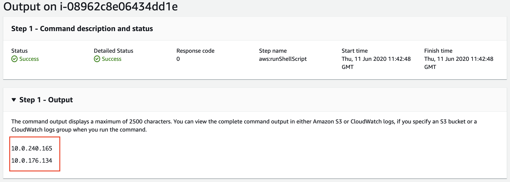

# API Gateway -> VPC Link (NLB) --> ALB --> EC2/ECS

This is a sample setup for APIGateway with VPCLink (NLB) to ALB into EC2. NLB, ALB and EC2 are all in private subnet.




## Steps:
- npm run build
- cdk deploy and wait for the Cloudformation Stack deployment to complete
- Please update the ALB IPs in the `nlb-alb-stack.ts` under `lib`
    ```
    const ALB_IP1= "" 
    const ALB_IP2= ""
    ```

- You can get the ALB IPs by using the AWS Systems Manager Run Command
    - Run Command
    - Choose `AWS-RunShellScript`
    - Command Parameters as `dig +short {internal-alb-dns}`
    - `Targets` - Choose instance manually and select `private-instance`
    - Leave the rests as default
    - Click Run and check the output

        

-  Update the ALB IPs and redeploy. 
> This could also be automated using Systems Manager Automation (*work in progress*) or alternatively, you can use the Lambda function from this blog article to have the NLB auto-register ALB IPs (when it changes)
    https://aws.amazon.com/blogs/networking-and-content-delivery/using-static-ip-addresses-for-application-load-balancers/


## Other useful commands

 * `npm run build`   compile typescript to js
 * `npm run watch`   watch for changes and compile
 * `npm run test`    perform the jest unit tests
 * `cdk deploy`      deploy this stack to your default AWS account/region
 * `cdk diff`        compare deployed stack with current state
 * `cdk synth`       emits the synthesized CloudFormation template
